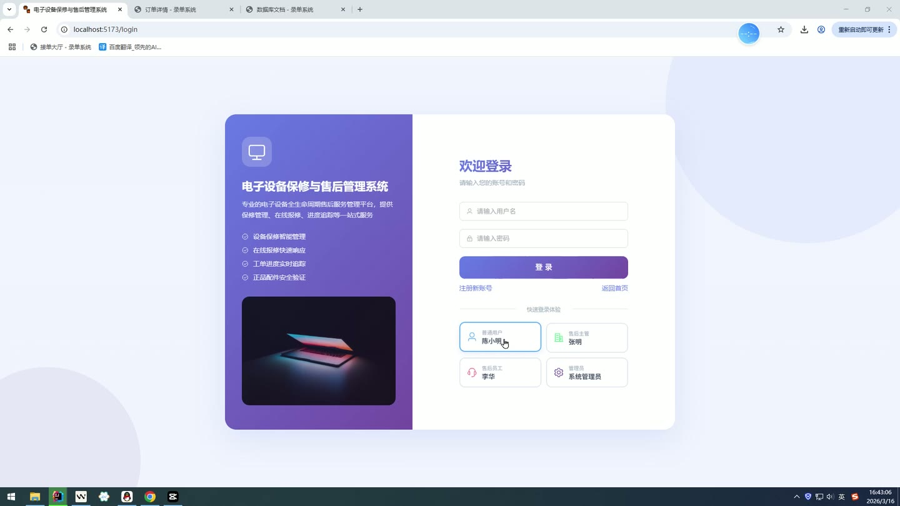
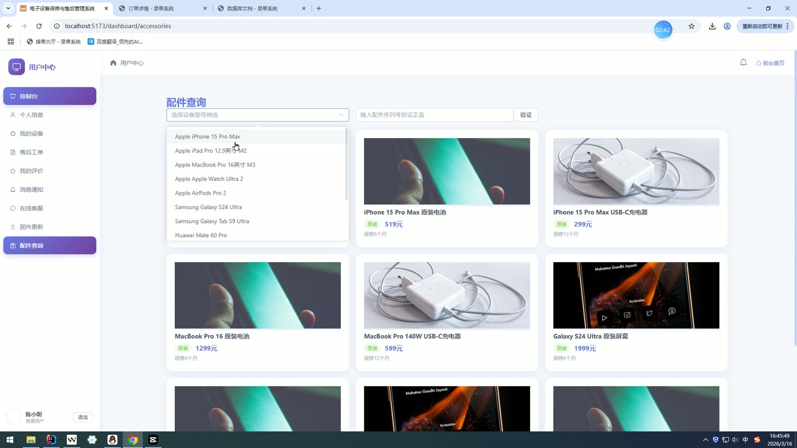
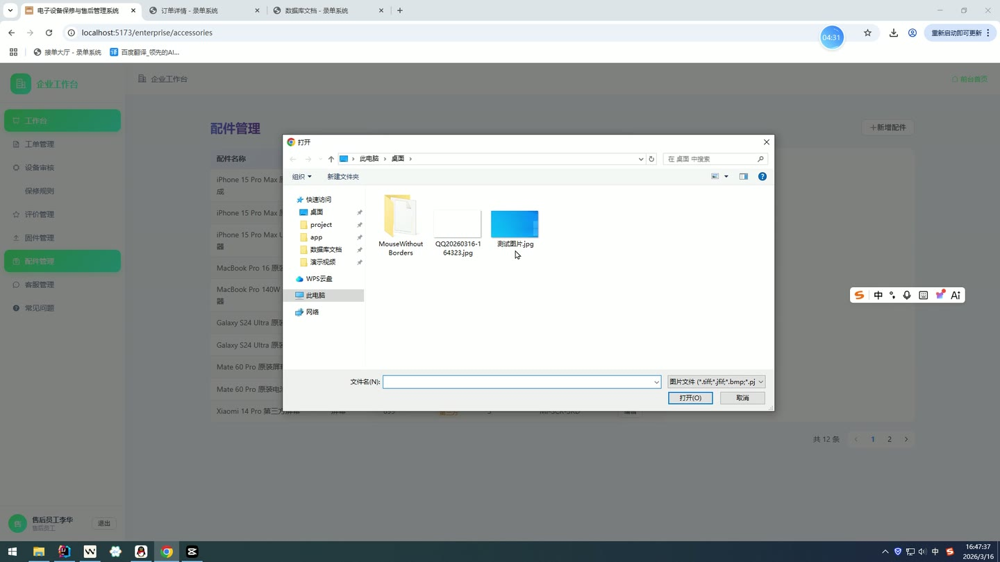
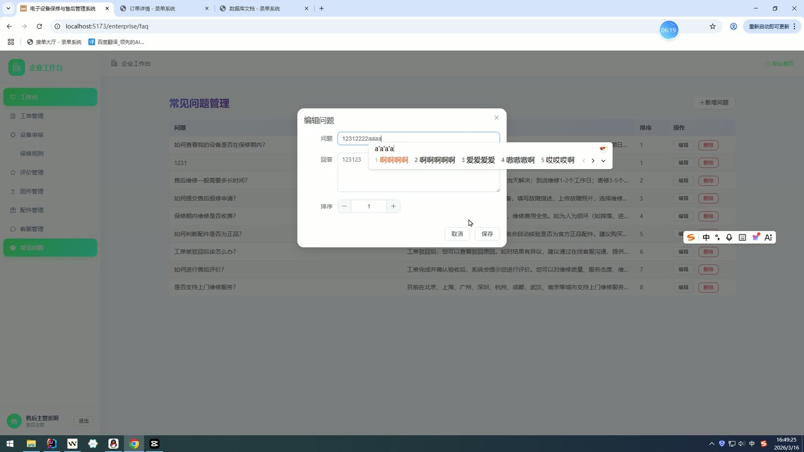
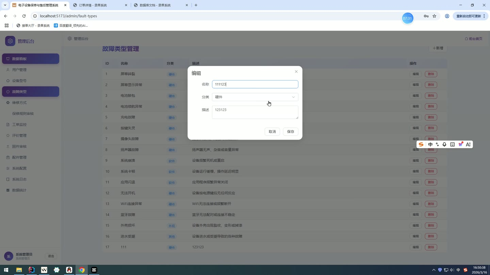
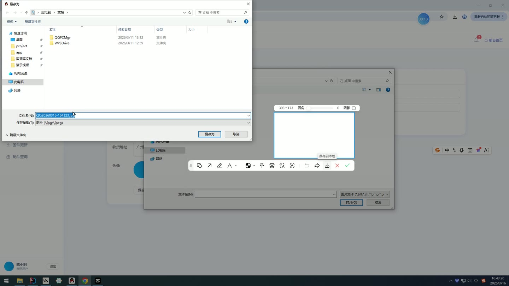

# (附文档)Springboot3+Vue3+MySQL 电子设备保修与售后管理系统

**技术栈**：Springboot3、Vue3、MySQL

### 系统简介

本系统是一套基于 Spring Boot 3 + Vue 3 前后端分离架构的电子设备保修与售后管理平台。系统支持普通用户、企业售后人员（商家端）和系统管理员三种角色，提供设备注册、保修规则审核、售后工单流转、固件与配件管理、在线沟通、通知推送、评价反馈等完整业务闭环。
 
### 核心功能
 
### 普通用户端

 
- 用户注册与登录：支持用户名密码注册、登录及快速登录（免密登录），登录后获取 JWT Token。 
- 个人信息管理：查看/编辑个人资料（真实姓名、手机、邮箱、地址、头像），修改登录密码（需验证旧密码）。 
- 我的设备管理：添加个人设备（录入设备型号、序列号、购买日期、购买凭证），查看设备列表及保修状态（待审核/已通过/已驳回/过期）。 
- 售后工单提交：选择故障设备、故障类型、维修类型，填写故障描述并上传故障图片，提交后生成唯一工单号（WO+日期+流水）。 
- 工单进度查看：按状态筛选工单列表（待受理/已受理/维修中/已完成/已驳回/已关闭），查看详情。 
- 工单确认关闭：维修完成后用户可手动确认工单关闭，结束售后流程。 
- 服务评价：对已完成的工单进行评价（打分含质量、态度、效率三维度，填写评价内容、差评原因、建议），支持上传评价图片；同一工单不可重复评价。 
- 通知消息：查看系统推送的通知列表（工单受理、进度更新、完成通知、保修审核结果、评价回复等），标记单条或全部已读，查看未读数量。  
- 在线客服聊天：与企业售后人员实时消息沟通（发送文本消息），查看历史聊天记录。 
- 固件下载：按设备型号筛选并查看已审核通过的固件版本列表，获取下载链接。 
- 配件查询：按设备型号浏览配件列表（名称、类别、价格、是否原厂、保修月数），通过序列号前缀验证配件真伪。
 
### 管理员端

 
- 仪表盘数据总览：查看总用户数、总工单数、待受理工单数、已完成工单数、设备总数、评价统计（好评率、各星级数量）、待审核保修规则数、待审核固件数。 
- 用户管理：分页查询用户列表（支持按用户名/真实姓名/手机号关键字搜索及按角色筛选），创建新用户，启用/禁用用户账号，重置用户密码为 123456。 
- 设备型号管理：分页查询设备型号（支持按品牌/型号名称关键字及分类筛选），新增/编辑/删除设备型号（品牌、型号名称、分类、图片、描述、状态）。 
- 故障类型管理：查看故障类型列表，新增/编辑/删除故障类型（名称、分类、描述）。 
- 维修类型管理：查看维修类型列表，新增/编辑/删除维修类型（名称、描述）。 
- 保修规则审核：分页查看保修规则列表（按状态筛选），审核通过或驳回企业提交的保修规则，填写审核备注。 
- 工单管理：查看所有工单列表（支持按状态筛选），查看工单详情。 
- 评价管理：查看所有用户评价列表（支持按评分筛选），查看评价详情及统计报表（好评率、各星级数量）。 
- 系统配置管理：查看系统配置键值列表，编辑配置项的值。 
- 操作日志：分页查看系统操作日志（支持按日志类型筛选），记录操作人、操作内容、请求方法、参数、IP 地址。 
- 固件审核：查看企业提交的固件列表，审核通过或驳回固件版本。 
- 配件管理：查看配件列表（支持分页），查看配件详情。 
- 工单统计：查看各状态工单数量统计（待受理/已受理/维修中/已完成/已驳回/已关闭）。
 
### 商家端

 
- 商家仪表盘：查看待受理工单数、维修中工单数、已完成工单数、待审核设备数、评价统计。 
- 工单受理：查看所有工单列表（支持按状态筛选），受理工单（状态变为已受理）并自动发送通知给用户。 
- 工单驳回：填写驳回原因后驳回工单，系统自动通知用户。 
- 工单指派与维修：指派工单给内部维修人员（assignTo 字段），状态变为维修中，通知用户。 
- 工单完成：将维修中工单标记为已完成，通知用户确认验收。 
- 用户设备审核：查看用户提交的设备列表（按保修状态筛选），审核通过或驳回设备保修资格；审核通过时根据保修规则自动计算保修到期日期（购买日期+保修月数），通知用户审核结果。 
- 保修规则管理：新增保修规则（关联设备型号、保修月数、保修范围、免责条款），提交后状态为待审核；编辑已有规则。 
- 评价回复：查看用户评价列表，对评价进行回复（填写回复内容），系统通知用户。 
- 固件发布：新增固件版本（关联设备型号、版本号、描述、下载链接），提交后状态为待审核。 
- 配件管理：新增/编辑配件（名称、类别、价格、是否原厂、保修月数、序列号前缀、图片），查看配件列表。 
- 内部员工列表：查看所有企业角色用户列表。 
- 在线客服：与用户进行实时聊天（发送/接收消息），查看最近聊天列表。 
- 常见问题管理：新增/编辑/删除常见问题（问题、答案、排序），查看公开 FAQ 列表。
 
### 技术栈

 后端框架Spring Boot 3 ORMMyBatis-Plus 权限认证Spring Security + JWT 前端框架Vue 3 状态管理Vue Router + Pinia 构建工具Vite 数据库MySQL 文件上传MultipartFile
 
### 交付内容

 
- 后端完整源码 
- 前端完整源码 
- 数据库初始化脚本 
- 万字文档

## 界面展示

---

## 获取完整源码 + 万字文档

本仓库为项目介绍页。**完整前后端源码、数据库初始化脚本、万字项目文档**，请加微信 `kangkangcode`，或访问 [codekk.top](http://codekk.top) 获取。

可作课程设计 / 毕业设计参考，支持远程部署调试。